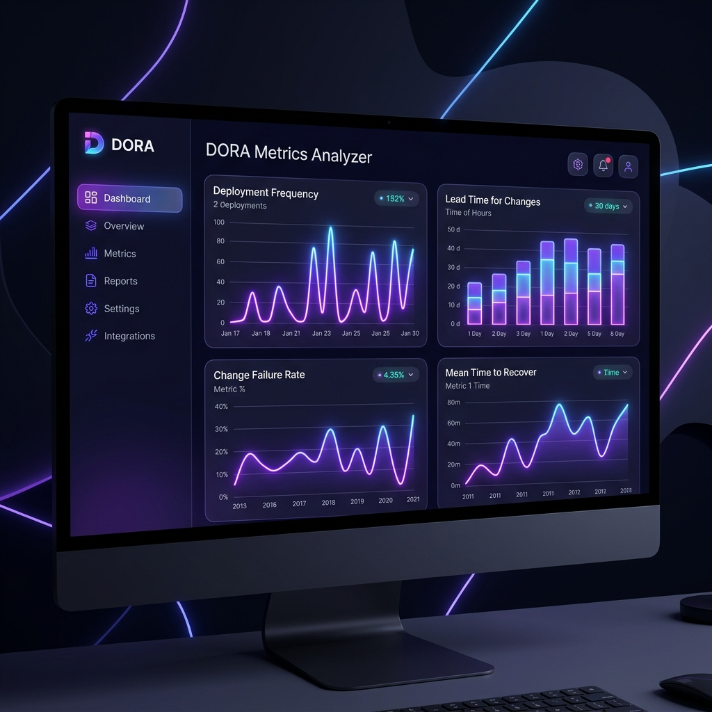

<p align="center">
  
</p>

<h1 align="center">🚀 DORA Metrics Analyzer</h1>

<p align="center">
  <strong>The Ultimate AI-Powered DevOps Intelligence Platform</strong>
</p>

<p align="center">
  
  
  
  
  
  
</p>

<p align="center">
  Unlock elite engineering performance. Calculate, visualize, and analyze your DORA Metrics (Deployment Frequency, Lead Time, MTTR, CFR) completely automatically through the GitHub API and advanced LLM reasoning.
</p>

---

## ✨ The WOW Factor

Traditional dashboards just show you raw numbers. **DORA Metrics Analyzer** is different. By natively integrating **Google Gemini 2.5 Flash** through LangChain, we don't just calculate your metrics; we *read* your Pull Requests, *understand* your release notes, and *detect* exactly which deploys caused regressions.

- **🌌 Stunning Glassmorphism UI:** Built with React, Vite, and Recharts. An interface so sleek and responsive your engineering team will actually *want* to check their metrics.
- **📄 Enterprise PDF Exports:** Generate breathtaking, highly corporate PDF reports directly from the browser. Complete with vectorized charts, beautiful cover pages, and recurring footers.
- **⚡ Real-Time Streaming (SSE):** Watch your AI analysis stream live onto the screen. No more staring at loading spinners while the LLM thinks.
- **🛡️ Enterprise Security First:** Hardened with SlowAPI Rate Limiting, strict Pydantic validations, and Bandit SAST checks on every commit.

## 📊 Core Features

| Feature | Description |
|---|---|
| **Deployment Frequency** | Accurately calculates how often your team successfully releases to production. |
| **Lead Time for Changes** | Measures the exact time from the first commit to production deployment. |
| **Change Failure Rate** | AI automatically correlates your incident reports to your releases. |
| **Mean Time to Recovery** | Measures how quickly your team bounces back from a failure. |
| **PR Cycle Time** | Analyzes code review bottlenecks to speed up your pipeline. |

## 🚀 Quick Start

Get your elite DevOps dashboard running locally in under 2 minutes.

### 1. Prerequisites
- Python 3.10+ and Node.js 24+
- `GITHUB_TOKEN` (for repository access)
- `GOOGLE_API_KEY` (for Gemini AI analysis)

### 2. Setup
Clone the repository and install dependencies:
```bash
git clone https://github.com/rncantos/dora-metrics.git
cd dora-metrics
```

**Backend:**
```bash
pip install -r requirements.txt
cp .env.example .env # Add your keys here
uvicorn backend:app --reload
```

**Frontend:**
```bash
cd frontend
npm ci
npm run dev
```

Open `http://localhost:5173` and prepare to be amazed.

## 📚 Documentation

Dive deeper into our architecture, API, and setup guides:
- 📖 [Setup and Installation Guide](docs/setup.md)
- 🏗️ [System Architecture](docs/architecture.md)
- 🔌 [API Documentation](docs/api.md)
- 🤝 [Contributing Guidelines](CONTRIBUTING.md)

## 📝 License

Designed and engineered with ❤️. Licensed under the [MIT License](LICENSE).
